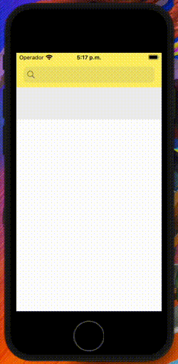
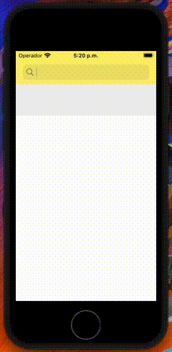

# MeLi Challenge Tech 

_Aplicación que muestra un listado de productos y sus detalles a partir de una búsqueda realizada por el usuario._
_La búsqueda de los productos, así como todos los detalles de los mismo se realizo utilizando las APIs de MercadoLibre_

## Preview

  

## Construido con 🛠️

* [Swift Package Manager](https://developer.apple.com/documentation/swift_packages/adding_package_dependencies_to_your_app) - Gestor/Manejador de dependencias
* [Alamofire](https://github.com/Alamofire/Alamofire) - Librería que nos permite realizar peticiones HTTP
* [MVP] - Patrón de diseño

Desarrollado por [Arturo@7th.dev](https://gitlab.com/Arturo.7th.Dev) 😊
